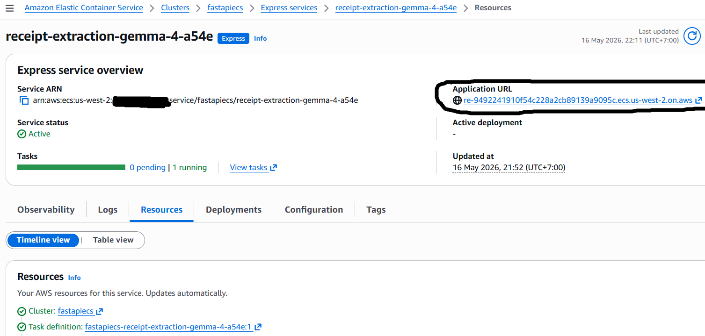
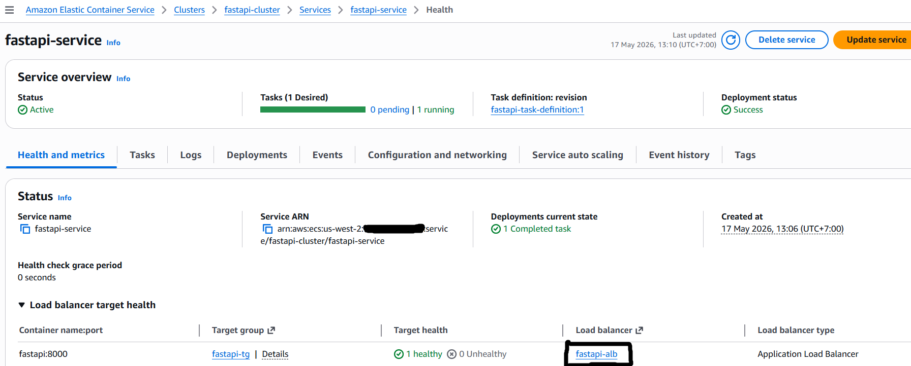
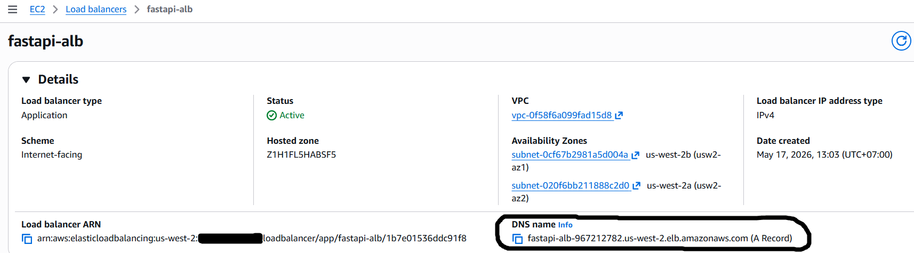

## Amazon SageMaker AI : SageMaker Studio, vLLM, Gemma 4 and Terraform for Receipt Extraction

1. Make sure already followed the instructions at [this link](https://dev.to/budionosan/amazon-sagemaker-sagemaker-studio-vllm-gemma-4-and-terraform-for-receipt-extraction-2cke) from step 1 until step 5.

2. Clone this repository in the JupyterLab instance terminal and all files are now available.
```
git clone https://github.com/budionosanai/google-gemma-sagemaker-vllm-fastapi-receipt-extraction.git
cd google-gemma-sagemaker-vllm-fastapi-receipt-extraction
```

3. Run this shell script in the **vllm** folder to pull and push the vLLM image to the ECR private repository.
```
cd vllm
chmod +x vllm-to-ecr.sh
./vllm-to-ecr.sh
```

3A. [OPTIONAL] Run [this notebook](./vllm/vllm-sg-endpoint.ipynb) to create the SageMaker model, endpoint configuration, endpoint and test several sample photos then delete a SageMaker model, endpoint configuration and endpoint to avoid unnecessary costs.

4. Run this script to install Terraform. 
```
/bin/bash -c "$(curl -fsSL https://raw.githubusercontent.com/Homebrew/install/HEAD/install.sh)"

eval "$(/home/linuxbrew/.linuxbrew/bin/brew shellenv bash)"

brew install gcc

brew tap hashicorp/tap

brew install hashicorp/tap/terraform

terraform --version
```

5. Run this Terraform command in the **terraform/sagemaker** folder to create the SageMaker model, endpoint configuration and endpoint.
```
cd ..

cd terraform

cd sagemaker

terraform init

terraform plan

terraform apply --auto-approve
```

6. Run this script in the **app** folder to build and push the receipt extraction API image to the ECR private repository.
```
cd ..

cd app

aws ecr create-repository \
    --repository-name "receipt-extraction-gemma-4" \
    --image-scanning-configuration scanOnPush=false \
    --image-tag-mutability MUTABLE \
    --region "us-west-2" 2>/dev/null || echo "Repository already exists, skipping creation."

pip install sagemaker-studio-image-build

sm-docker build . --repository receipt-extraction-gemma-4:latest
```

## Amazon Elastic Container Services (ECS) : Express Mode and Custom Mode for Receipt Extraction

## Express Mode

1. Run this Terraform command in the **terraform/ecs** folder to create the API infrastructure using Amazon ECS Express Mode.
```
cd ..

cd terraform

cd ecs

terraform init

terraform plan

terraform apply --auto-approve
```

2. Navigate to Amazon ECS then copy the ECS express service application URL as shown in the screenshot below.



3. Open `https://re-...on.aws/health` in your browser to make sure the API is healthy and return 200 OK.

4. Open `https://re-...on.aws/docs` in your browser to test the `/predict` API. Upload some sample photos from the **photos** folder then wait a few seconds to get the structured output.

5. Run this Terraform command in the **terraform/ecs** folder for delete Amazon ECS Express Mode resources.
```
terraform destroy --auto-approve
```

## Custom Mode

1. Run this Terraform command in the **terraform/ecs-custom** folder to create the API infrastructure using Amazon ECS Custom Mode.
```
cd ..

cd terraform

cd ecs-custom

terraform init

terraform plan

terraform apply --auto-approve
```

2. Navigate to Amazon ECS then copy the application load balancer (ALB) DNS name as shown in the screenshot below.





3. Open `http://fastapi-alb-...elb.amazonaws.com/health` in your browser to make sure the API is healthy and return 200 OK.

4. Open `http://fastapi-alb-...elb.amazonaws.com/docs` in your browser to test the `/predict` API. Upload some sample photos from the **photos** folder then wait a few seconds to get the structured output.

5. Run this Terraform command in the **terraform/ecs-custom** folder to delete Amazon ECS Custom Mode resources.
```
terraform destroy --auto-approve
```

6. Run this Terraform command in the **terraform/sagemaker** folder to delete SageMaker model, endpoint configuration and endpoint.
```
terraform destroy --auto-approve
```

7. Run this script to delete the vLLM image and receipt extraction API image in the ECR private repositories.
```
aws ecr delete-repository --repository-name receipt-extraction-gemma-4 --force --region us-west-2

aws ecr delete-repository --repository-name vllm-gemma-4 --force --region us-west-2
```

8. In SageMaker Studio JupyterLab, click **Stop space** and [delete your SageMaker Studio domain.](https://docs.aws.amazon.com/sagemaker/latest/dg/gs-studio-delete-domain.html#gs-studio-delete-domain-studio)