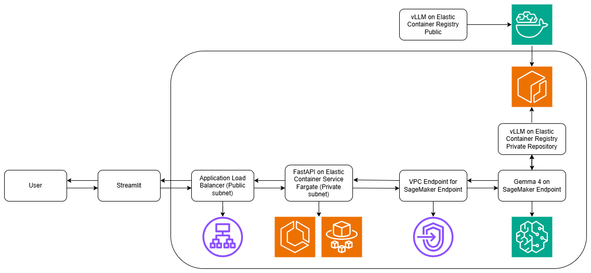

## 📋 Overview

Before using receipt extraction, show several problems such as different receipt formats, repeated manual checks, multilingual receipts, and inconsistent output formats.
This repository explains end-to-end receipt extraction use case that can extract structured and accurate information from receipt photo using Gemma 4 E4B-it model.

## 🏗️ Architecture



## 🛠️ Tech Stack

| AWS Service | Description |
| :--- | :--- |
| Amazon SageMaker AI | Create SageMaker Studio as a IDE, model and endpoint as inference and serving. |
| Amazon Elastic Container Registry (ECR) | Create private image such as vLLM image and receipt extraction API image. |
| Amazon Elastic Container Services (ECS) | Create API using Express Mode and custom mode. |
| vLLM on AWS Deep Learning Containers (DLC) | Open-source inference and serving engine for Large Language Models such as Gemma 4. |
| Amazon Virtual Private Cloud (VPC) | AWS networking service such as VPC, subnet, security group, VPC endpoint, etc. |
| Application Load Balancer (ALB) | Load balancer that serve API on ECS custom mode. |
| AWS Identity and Access Management (IAM) | Access to AWS services with least privilege. |

| Name | Description |
| :--- | :--- |
| Terraform | Infrastructure-as-Code (IaC) tool that automatically creating cloud resources. |
| Gemma 4 | Open-source Large Language Models from Google. |
| FastAPI | Web framework for building APIs with Python. |
| Streamlit (optional) | Web framework for building application with Python. |

## 📁 Repository Structure

```bash
.
├── app/		# Folder of build and push receipt extraction API to Amazon ECR.
├── images/		# Folder of architecture and ECS URL.
├── photos/		# Folder of receipt photo samples.
├── streamlit/		# Folder of Streamlit web application code.
├── terraform/		# Folder of Infrastructure-as-Code for AWS services such as Amazon ECS and Amazon SageMaker AI.
│   ├── ecs/		# Folder of create API infrastructure using Amazon ECS Express Mode.
│   ├── ecs-custom/	# Folder of create API infrastructure using Amazon ECS Custom Mode.
│   ├── sagemaker/	# Folder of create model and endpoint infrastructure as inference and serving using Amazon SageMaker Endpoint.
├── vllm/		# Folder of push vLLM image to Amazon ECR and test vLLM image with Gemma 4 to Amazon SageMaker Endpoint.
```

## 📖 Instruction

You can see the instruction in [this file.](./INSTRUCTION.md)

## 💰 Cost

| AWS Service | Description |
| :--- | :--- |
| Amazon SageMaker AI | SageMaker Studio JupyterLab - ml.t3.medium - $0.05 per hour |
| Amazon SageMaker AI | SageMaker Real-time Inference (Endpoint) - ml.g6.2xlarge - $1.222 per hour |
| Amazon ECR | $0.10 per GB |
| Amazon ECS (Fargate)| $$0.04048 per vCPU per hour and $0.004445 per GB per hour |
| Application Load Balancer (ALB) | $0.0225 per hour and $0.008 per LCU-hour |
| Amazon VPC | Interface VPC endpoint (AWS PrivateLink) - $0.01 per VPC endpoint per AZ per hour and and $0.01 per GB |
| Amazon VPC | Gateway VPC endpoint (AWS PrivateLink) - $0.01 per VPC endpoint per AZ per hour and $0.0035 per GB |

## ✍️ Tutorial Blog

- https://dev.to/budionosan/amazon-sagemaker-sagemaker-studio-vllm-gemma-4-and-terraform-for-receipt-extraction-2cke
- https://dev.to/budionosan/amazon-elastic-container-services-ecs-express-mode-and-custom-mode-for-receipt-extraction-2947

## 🙏 Acknowledgments

**Amazon Web Services (AWS), Google Gemma, vLLM, Terraform, FastAPI and Streamlit**